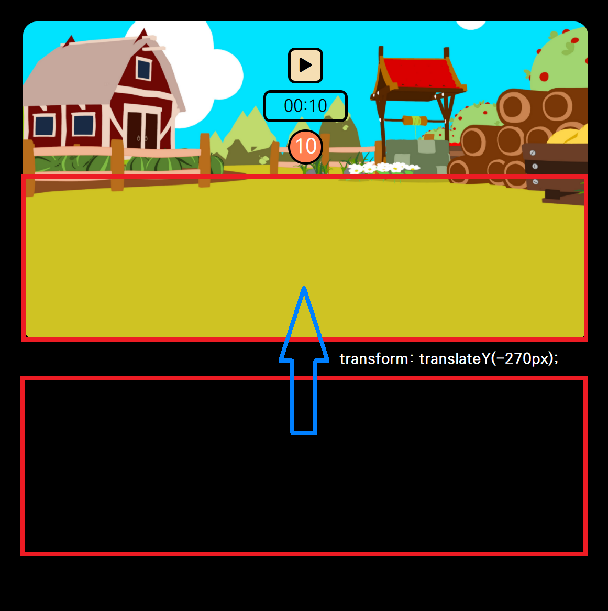

# 당근 찾기 게임

드림코딩 [<프론트엔드 필수 브라우저 101>](https://academy.dream-coding.com/courses/browser101) 강의 中 실습10

<br>

> ## 🗓 프로젝트 기간

- 2021.09.08 ~ 2021.09.14, 2021.09.19

<br>

> ## 📌 구현 내용

- 바닐라 JS를 활용한 게임 구현

- 게임 요소

  - 시작 버튼, 중지 버튼, 재시작 버튼

  - 남은 시간을 표시하는 타이머

  - 남은 당근의 개수를 표시하는 카운터

  - 게임 결과 (성공 / 실패 / 중지)를 나타내는 팝업창
  
- 게임 규칙

  - 게임이 시작되면, 당근과 곤충이 무작위의 위치에 생성된다.

  - 제한 시간 내에 당근을 모두 클릭해서 제거해야 한다.

  - 제한 시간이 넘어가거나, 곤충을 클릭하면 게임 오버가 된다.

<br>


<br>

> ## ✅ 기억할 만한 코드

### 1. 코드의 재사용성 높이기

CSS에서는 `cursor: pointer;`, `display: none` 등 반복되는 선언을 커스텀 클래스로 만들어, 쉽게 재사용할 수 있도록 만들고 가독성을 높였다.

```css
.absolute {
  position: absolute;
}

.display-none {
  display: none;
}

.hidden {
  visibility: hidden;
}

.larger-on-hover:hover {
  transform: scale(1.1);
}
```

JS에서는 특정 요소의 클래스에 속성을 추가하거나 제거하는 부분이 반복되어, 이 부분을 함수화했다. 이를 CSS에서 만든 커스텀 클래스와 함께 사용하여, 쉽게 특정 요소에 속성을 추가하거나 제거할 수 있게 했다.

```javascript
// 요소에 해당 속성이 없다면 추가하는 함수
const setAttribute = (element, attribute) => {
  if (!element.classList.contains(attribute)) {
    element.classList.add(attribute);
  }
}

// 요소에 해당 속성이 있다면 제거하는 함수
const removeAttribute = (element, attribute) => {
  if (element.classList.contains(attribute)) {
    element.classList.remove(attribute);
  }
}
```

```javascript
// 게임 시작 => 시작버튼 X / 중지버튼 O / 팝업창 X
const setToStart = () => {
  setAttribute(playBtn, 'display-none');
  removeAttribute(stopBtn, 'display-none');
  removeAttribute(stopBtn, 'hidden');
  setAttribute(popup, 'hidden');
}
```

<br>

### 2. setInterval/clearInterval 함수를 이용한 타이머 구현

매 초마다 남은 시간을 표시하는 타이머를 구현하기 위해, 우선 Timer 클래스를 만들었다. Timer 클래스는 인스턴스는 초기값이 10인 `second` 속성과 second를 1씩 줄어들게 하는 `decrease()` 메소드를 가진다.

```javascript
class Timer {
  constructor() {
    this.second = 10;
  }

  decrease() {
    (this.second === 0) ? endGame() : this.second--;
  }
}
```

다음으로 `setInterval` 함수를 통해 1초마다 runTimer 함수가 실행되도록 했다. startTimer 함수에서 Timer 클래스의 인스턴스를 생성한 뒤, `setInterval` 함수의 세 번째 인자로 넣어, 함수의 첫 번째 인자인 runTimer 함수의 인자로 들어가도록 했다.

runTimer 함수에서는 남은 시간을 타이머 요소에 표시하는데, `padStart` 함수를 통해 남은 시간이 한 자리인 경우에도 `00:05`와 같이 형식을 유지하도록 했다. 그 다음 second 속성의 값을 1 감소시킨다. 

```javascript
const runTimer = (timer) => {
  timerElement.innerHTML = `00:${timer.second.toString().padStart(2, '0')}`;
  timer.decrease();
}

const startTimer = () => {
  const timer = new Timer();
  runTimer(timer);
  interval = setInterval(runTimer, 1000, timer);
}

// 게임을 시작할 때 실행되는 함수
const startGame = () => {
  ...(중략)...
  startTimer();
}
```

주어진 시간이 끝나거나 사용자가 곤충을 클릭한 경우, 타이머는 멈춰야 한다. 이를 위해 위 코드에서는 `setInterval` 함수를 실행하는 동시에, 이 함수를 `interval` 변수에 저장했다. 이를 통해 이후에 `clearInterval` 함수를 통해 `setInterval` 함수를 멈출 수 있도록 했다. 물론 `interval` 변수를 여러 함수에서 사용할 수 있는 이유는, 전역 변수로 설정했기 때문이다.

```javascript
// 게임에서 이기거나 져서 게임이 끝날 때 실행되는 함수
const endGame = () => {
  ...(중략)...
  clearInterval(interval);
}
```

<br>

### 3. 벌레와 당근 랜덤 배치하기

처음에는 전체 브라우저 크기를 기준으로, 당근과 곤충이 올 수 있는 영역을 계산한 다음, 랜덤 위치에 배치했다.

```javascript
// 당근 n개를 임의의 위치에 배치하는 함수
const showCarrots = (n) => {
  for (let i = 0; i < n; i++) {
    let randomX = getRandomValue(window.innerWidth / 2 - 375, window.innerWidth / 2 + 325);
    let randomY = getRandomValue(250, 425);

    gameField.innerHTML += ``;
  }
}
```

위 코드의 문제는, 당근의 위치를 계산하는 부분이 게임 화면의 크기 및 브라우저의 크기에 의존적이라는 점이다. 

위 문제를 해결하기 위해, 우선 당근과 게임이 배치될 필드 부분(`gameField`)을 정의했다. 그런데 필드의 위치를 팝업창이 이미 차지하고 있기 때문에, 그 아래에 영역을 만든 후, `transform: translate`를 통해 위치를 조정했다.

```css
.gameField {
  width: 800px;
  height: 220px;
  margin: 0 auto;
  transform: translateY(-270px);
}
```

<p align="center">
  
</p>

그 후, 해당 영역을 기준으로 랜덤한 좌표를 만들었다. 각 당근/곤충 이미지 요소에 `position: absolute` 속성을 추가하여, 브라우저 전체가 아니라 부모 요소(`gameField`)를 기준으로 상대적인 위치를 가질 수 있도록 했다.

또한 랜덤한 좌표를 만들 때, `gameField`의 가로/세로 길이를 재기 위해, `getBoundingClientRect()` 메서드를 활용했다.

```javascript
const gameField = document.querySelector('.gameField');
const fieldRect = gameField.getBoundingClientRect();

// 당근 n개를 임의의 위치에 배치하는 함수
const showCarrots = (n) => {
  for (let i = 0; i < n; i++) {
    const randomX = getRandomValue(0, fieldRect.width - 66);
    const randomY = getRandomValue(0, fieldRect.height - 80);

    gameField.innerHTML += ``;
  }
}
```