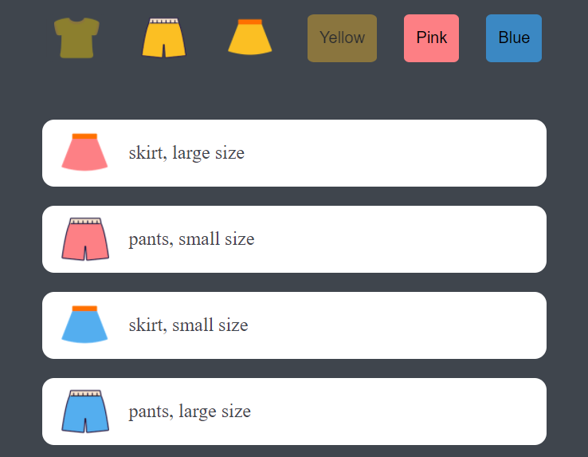

# 쇼핑몰 미니게임 클론코딩

드림코딩 님의  [<쇼핑몰 미니게임 클론 코딩 & 코드 리뷰>](https://academy.dream-coding.com/courses/mini-shopping) 강의 과제

 

> ## 🗓 프로젝트 기간

#### try 1 (영상 보기 전)

- 2021.08.18

 

> ## 📌 구현 내용

- CSS Flex를 활용하여 유튜브 레이아웃 구현

- 미디어 쿼리 문법으로 반응형 웹 페이지 구현

- JS를 통해 옷 타입 및 색깔 버튼에 따른 제품 필터링 기능 구현

