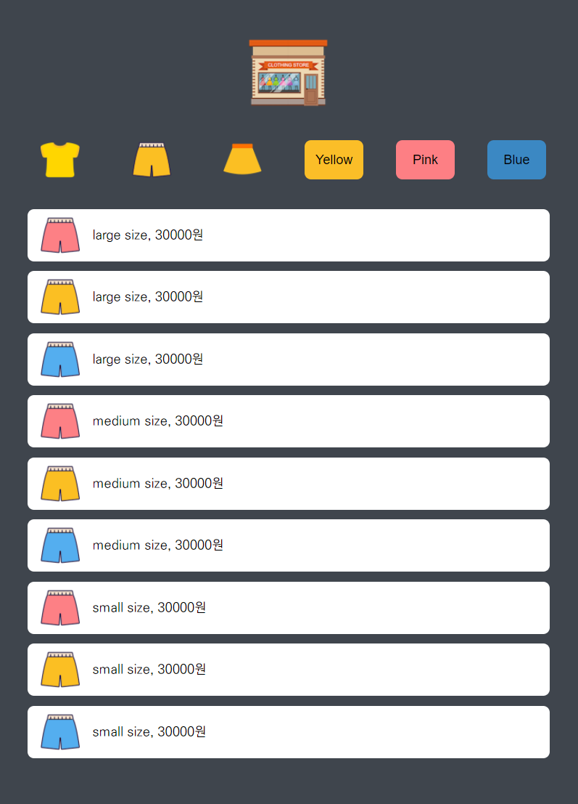
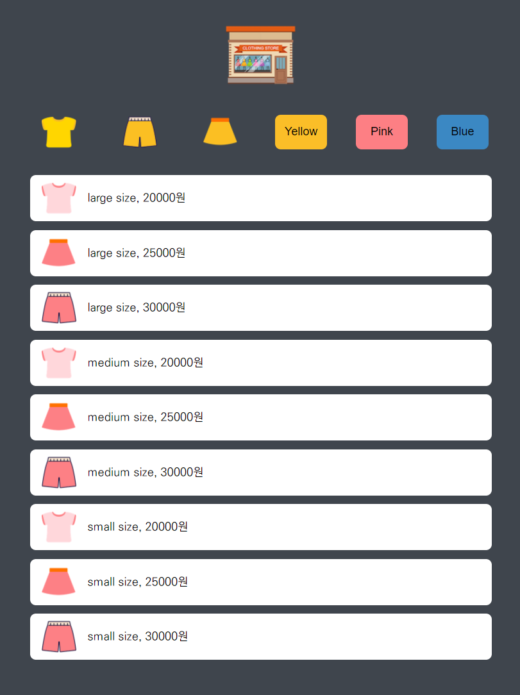

# 쇼핑몰 미니게임 클론코딩

드림코딩 님의  [<쇼핑몰 미니게임 클론 코딩 & 코드 리뷰>](https://academy.dream-coding.com/courses/mini-shopping) 강의 과제

<br>

> ## 🗓 프로젝트 기간

#### try 1 (영상 보기 전)

- 2021.08.18

#### try 2 (영상 본 후)

- 2021.08.24 ~ 2021.08.25

<br>

> ## 📌 구현 내용

- CSS Flex를 활용하여 유튜브 레이아웃 구현

- 미디어 쿼리 문법으로 반응형 웹 페이지 구현

- JS를 통해 옷 타입 및 색깔 버튼에 따른 제품 필터링 기능 구현

- (try 2 추가) json 파일로부터 제품 데이터를 가져오는 방식으로 구현

<br>

<p align="center">
  
  
</p>


<br>

> ## ✅ 기억할 만한 코드

첫 번째 구현에서는 버튼 클릭시 제품 필터링 기능을 구현하기 위해, 각 버튼에 대하여 이벤트를 구현했다.

```javascript
const topBtn = document.getElementById("top");
const pantsBtn = document.getElementById("pants");
const skirtBtn = document.getElementById("skirt");
const yellowBtn = document.getElementById("yellow");
const pinkBtn = document.getElementById("pink");
const blueBtn = document.getElementById("blue");


const changeTypeState = articles => {
  ...(중략)...
}

const changeColorState = articles => {
  ...(중략)...
}

topBtn.addEventListener('click', () => {
  changeTypeState(document.querySelectorAll(".top"));
})

pantsBtn.addEventListener('click', () => {
  changeTypeState(document.querySelectorAll(".pants"));
})

skirtBtn.addEventListener('click', () => {
  changeTypeState(document.querySelectorAll(".skirt"));
})

yellowBtn.addEventListener('click', () => {
  changeColorState(document.querySelectorAll(".yellow"));
})

pinkBtn.addEventListener('click', () => {
  changeColorState(document.querySelectorAll(".pink"));
})

blueBtn.addEventListener('click', () => {
  changeColorState(document.querySelectorAll(".blue"));
})
```

두 번째 구현에서는 `이벤트 위임(event delegation)`을 활용하여, 하나의 함수로 모든 버튼에 제품 필터링 기능을 구현했다.

```javascript
// 버튼 클릭시 필터링된 아이템 목록이 보이도록 하는 함수
function onButtonClick(event, items) {
  const key = event.target.dataset.key;
  const value = event.target.dataset.value;

  if (key == null) {
    return;
  }

  displayItems(items.filter(item => item[key] === value));
}

// 이벤트 리스터들을 지정하는 함수
function setEventListeners(items) {
  const buttons = document.querySelector('.buttons');
  buttons.addEventListener('click', 
    event => onButtonClick(event, items));
}
```