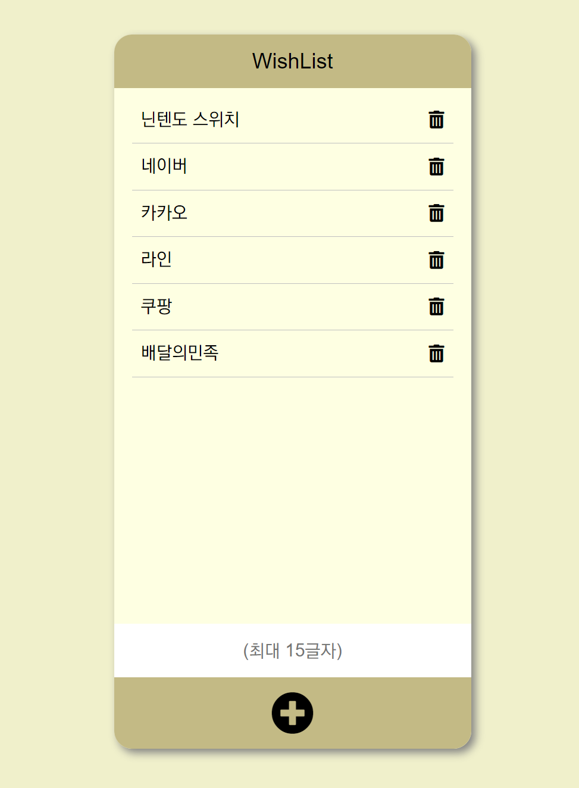
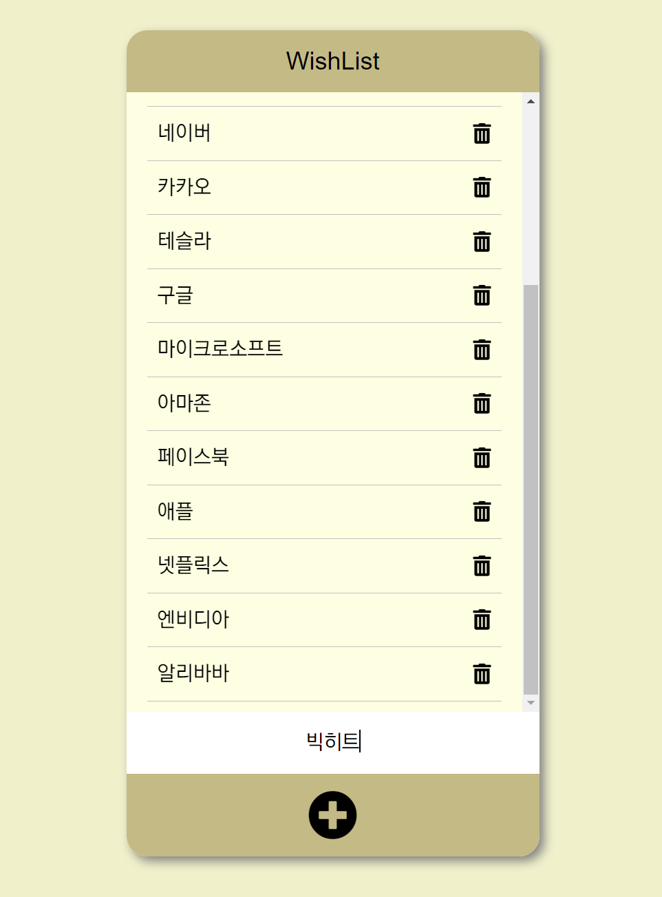

# 쇼핑 목록앱 만들기

드림코딩  [<프론트엔드 필수 브라우저 101>](https://academy.dream-coding.com/courses/browser101) 강의 中 실습7 / 실습9

<br>

> ## 📌 구현 내용

- 추가 및 삭제가 가능한 쇼핑 목록앱 구현

- `Create` : 입력창에 내용을 입력한 뒤, Enter키를 치거나 추가 버튼을 클릭하면 요소 추가

- `Delete` : 삭제 버튼(쓰레기통 아이콘)을 클릭하면 해당 요소 삭제

<br>

<p align="center">
  
  
</p>

<br>

> ## ✅ 기억할 만한 코드

### 1. 삭제 기능 구현

#### 문제

삭제 버튼에 이벤트를 등록하는 것이 쉽지 않았다. 처음에는 아래와 같이 query selector로 삭제 버튼을 모두 가져온 뒤, 각각의 버튼에 이벤트를 등록하고자 했다. 하지만 이렇게 구현할 경우, 새로 추가한 요소의 삭제 버튼에는 이벤트가 등록되지 않았다. 

```javascript
const deleteBtns = document.querySelectorAll('.deleteBtn');

for (const deleteBtn of deleteBtns) {
  deleteBtn.addEventListener('click', () => {
    const node = deleteBtn.parentNode;
    items.removeChild(node);
  })
}
```

#### 해결

리스트에 요소를 추가할 때마다, 새로 만들어진 삭제 버튼에 이벤트를 등록했다. 이를 통해, 새로 추가된 요소에 대해서도 삭제 기능을 구현할 수 있었다. (하지만 버튼을 만들 때마다 이벤트를 등록하는 것이 좋은 방식은 아니다. 이는 아래 3번에서 다시 수정한다.)

```javascript
function createItem(value) {
  ...
  // 삭제 버튼을 만든 뒤, 바로 삭제 이벤트 등록
  const deleteBtn = document.createElement('i');
  deleteBtn.className = "fas fa-trash-alt deleteBtn";
  deleteBtn.addEventListener('click', () => {
    items.removeChild(node);
  })
  ...
}
```

<br>

### 2. 입력값 예외 처리

#### 문제

내용을 입력하지 않은 상태에서도, Enter키를 누르거나 추가 버튼을 클릭하면 리스트에 요소가 추가되었다. 

#### 해결

사용자에게 값을 받은 뒤, 공백 문자를 제거하는 `trim()` 함수를 통해 공백 문자를 제거했다. 공백 문자를 제거한 결과 빈 문자열이 아닌 경우에만, 새로운 요소를 생성하고 리스트에 추가하도록 했다. 이를 통해, 아무 값도 입력하지 않았거나 Space키로 띄어쓰기만 한 상태에서는 값이 추가되지 않게 만들었다.

```javascript
function addItem() {
  const value = userInput.value.trim();

  // 공백문자를 제거한 결과가 빈 문자열이 아니라면
  if (value) {
    const item = createItem(value);
    items.appendChild(item);
  }
  ...
}
```

<br>

### 3. 이벤트 위임 (실습 9 추가)

#### 문제

1번에서는 삭제 버튼을 만들 때마다, 새로 만들어진 삭제 버튼에 이벤트를 등록했다. 

#### 해결

`이벤트 위임(event delegation)`을 통해 삭제 버튼 전체에 한번에 이벤트를 등록할 수 있다. 또한 dataset을 활용하여 클릭한 버튼과 같은 id를 가진 요소를 삭제할 수 있도록 했다.

```javascript
// 이벤트 위임을 통해 삭제 버튼 전체에 한번에 이벤트 등록
items.addEventListener('click', event => {
  const id = event.target.dataset.delete_id;
  if (id) {
    const toBeDeleted = document.querySelector(`.item[data-id="${id}"]`);
    toBeDeleted.remove();
  }
})
```